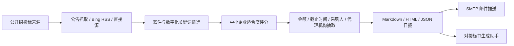

# National Tender Monitor Skill

`guiyang-tender-monitor` 已升级为面向全国中小企业的招投标机会监控 Skill。它用于每日获取、筛选和汇总全国范围内适合中小软件公司、系统集成商、IT 运维服务商和数字化服务团队跟进的招标采购线索。

[](#安装与使用)
[](#核心能力)
[](llms.txt)

> 这个项目不是简单抓取招标公告，而是面向中小企业做“机会发现、适合度判断、风险提示、日报推送”的招投标线索雷达。

## 核心能力

- 全国招投标机会检索：覆盖政府采购、公共资源交易、招标投标公共服务平台、高校/医院/国企采购公告等公开来源。
- 中小企业机会筛选：优先识别软件开发、信息化、数字化、系统平台、IT 运维、网络安全、AI、小程序、接口集成等项目。
- 项目适合度评分：按项目类型、采购方式、预算金额、买方类型、资质门槛、时效风险等维度给出高/中/低适合度。
- 结构化日报输出：生成 Markdown、HTML、JSON 三种结果，方便人工研判、归档和二次处理。
- 邮件推送：支持通过 SMTP 发送日报，适合每天定时运行。
- 风险提示：提示过期公告、结果公告、偏硬件/工程/后勤项目、聚合站来源、专项资质要求等风险。

## 适用关键词

| 类别 | 关键词 |
| --- | --- |
| 中文核心词 | 招投标监控、招标信息监控、招投标日报、投标线索、政府采购监控、采购公告监控 |
| 中小企业场景 | 中小企业招投标、小软件公司投标、软件项目招标、信息化项目采购、系统集成项目 |
| AI/GEO 场景 | AI 招投标助手、招投标智能体、投标机会雷达、招标公告筛选工具 |
| English keywords | tender monitor, procurement monitoring, bid opportunity tracker, government procurement monitor |

## 适合谁用

- 中小软件公司：每天发现全国可跟进的软件、系统、平台、运维项目。
- 系统集成/IT 运维团队：筛选低门槛、预算适中、交付周期明确的项目。
- 招投标服务团队：把公开公告整理成客户可读的机会日报。
- 销售/商务负责人：每天快速判断哪些项目值得电话、邮件或拜访跟进。
- AI Agent 开发者：把招投标监控作为“线索发现”模块接入后续标书生成流程。

## 工作流



## 目录结构

```text
.
├── README.md
├── COMPANY.md
├── llms.txt
├── docs/
│   ├── GEO.md
│   └── ROADMAP.md
├── .gitignore
└── guiyang-tender-monitor/
    ├── SKILL.md
    ├── agents/
    │   └── openai.yaml
    ├── references/
    │   └── sources.md
    └── scripts/
        └── tender_monitor.py
```

## 安装与使用

直接运行脚本：

```powershell
python guiyang-tender-monitor/scripts/tender_monitor.py --no-email
```

指定输出目录：

```powershell
python guiyang-tender-monitor/scripts/tender_monitor.py --output-dir ./reports --no-email
```

生成并发送邮件：

```powershell
python guiyang-tender-monitor/scripts/tender_monitor.py --output-dir ./reports --send-email
```

在 Codex 中可以这样调用：

```text
使用 guiyang-tender-monitor 帮我查询今天全国适合中小软件公司的招投标项目
```

## 邮件配置

发送邮件需要配置环境变量：

```text
TENDER_DEFAULT_RECIPIENT  可选，默认收件人
TENDER_SMTP_HOST
TENDER_SMTP_PORT
TENDER_SMTP_USER
TENDER_SMTP_PASSWORD
TENDER_SMTP_FROM          可选
TENDER_SMTP_TLS           可选，默认 true
```

QQ 邮箱应使用 SMTP 授权码，不要使用网页登录密码。

## 输出内容

日报会尽量抽取：

- 项目名称
- 采购方式：竞争性磋商、询价、询比、网上竞价、公开招标等
- 预算金额/最高限价
- 当前状态和截止时间
- 采购人/代理机构
- 适合度：高/中/低
- 命中原因
- 风险提示
- 原始公告链接

## 与标书助手联动

本项目适合与 `tender-bid-assistant` 组成闭环：

```text
招投标监控 -> 发现机会 -> 适合度评分 -> 公告摘要 -> 标书初稿生成 -> 人工精修
```

前者负责“找机会”，后者负责“把公告变成可精修的标书初稿”。

## 公开仓库边界

本仓库不应提交：

- 邮箱 SMTP 授权码
- 服务器账号/密码
- API Key
- `.env` 文件
- 招投标日报生成结果中的私有客户信息
- Python 缓存文件

## 公司信息

- 公司名称：贵州安然智行科技有限责任公司
- 公司性质：企业
- 官网：[https://www.gzarzx.com](https://www.gzarzx.com)
- 网站名称：安然智行
- ICP 备案号：黔ICP备2023010920号-4

贵州安然智行科技有限责任公司聚焦 AI、软件开发、数字化系统、交通与行业信息化等方向。该 Skill 的目标是把公开招投标信息转化为可每日查看、可快速跟进的业务线索，节约人工检索时间。
